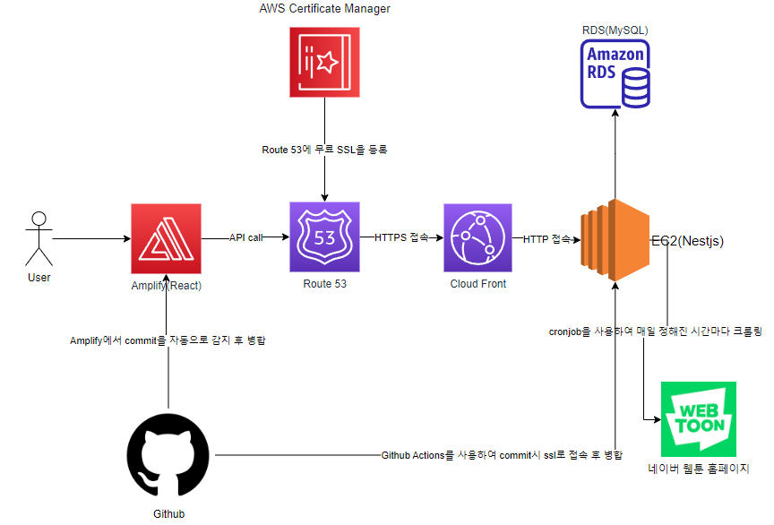

# 네이버 웹툰 분석기

## 네이버 웹툰은 정보를 제공해주는 API가 없어 직접 크롤링해서 웹툰에 관한 부가적인 정보를 볼 수 있도록 만든 사이트

## Tech Stack

React(Vite), MUI, React-query, React-Router-Dom <br/>
Nestjs, Typeorm, MySQL

## 실행 방법

Backend

```
cd ./backend
npm install
npm run start:dev
```

Frontend

```
cd ./frontend
npm install
npm run dev
```


