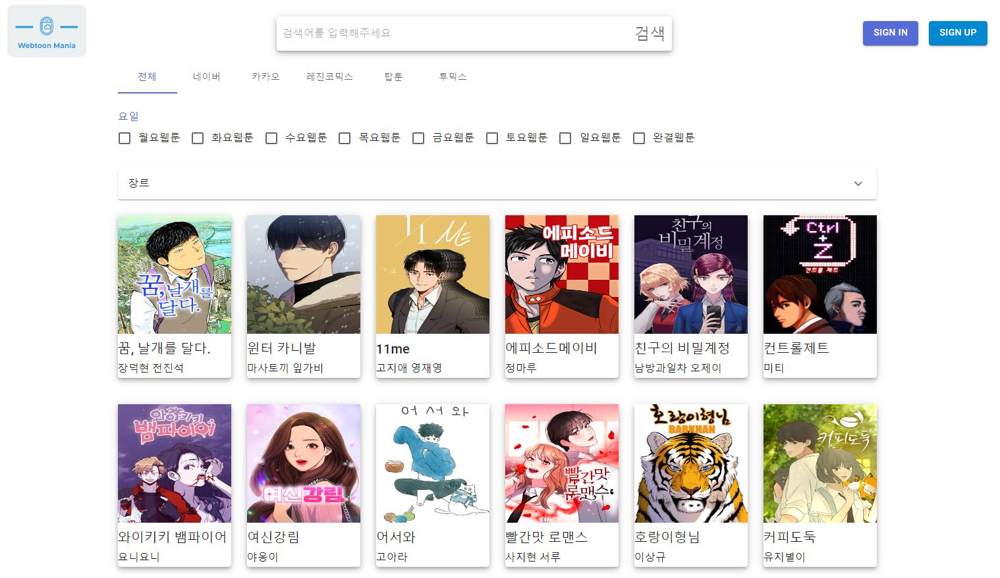

# Webtoon Mania


## 각 플랫폼들의 여러 웹툰들을 한번에 모아 보여주어 웹툰의 부가적인 정보를 볼 수 있고 리뷰를 남길 수 있다

-- 현재 계획 중인 플랫폼:

-- 완료된 플랫폼: 네이버, 카카오웹툰 , 탑툰, 레진코믹스, 투믹스

## Tech Stack

React(Vite), MUI, React-query, React-Router-Dom <br/>
Nestjs, Typeorm, MySQL

## Demo



## Architecture


## 실행 방법

Backend

```
cd ./backend
npm install
npm run start:dev
```

Frontend

```
cd ./frontend
npm install
npm run dev
```

## 주요 기능

- [x] 웹툰 크롤링 - 매일 특정 시간대에 각 웹툰 플랫폼에서 웹툰 정보를 크롤링하여 최신 상태를 유지한다
- [x] 웹툰 목록 보기 - 요일, 장르, 검색 등과 같은 각종 필터링이 가능하고 무한 스크롤 형태로 보여준다
- [x] 웹툰 상세 보기 - 특정 웹툰의 구체적인 정보를 확인 할 수 있다
- [x] 유저 - 로그인/회원가입/회원정보수정/회원정보삭제
- [x] 댓글 - 각 웹툰에 댓글을 남길 수 있다. 각 댓글은 좋아요와 싫어요가 있으며 조작 방지를 위해 수정은 불가 작성/삭제만 가능
- [ ] 알람 - 내가 즐겨찾기 한 웹툰이 업로드가 된 경우 알람이 전송된다
- [x] 채팅방 - 웹툰 별 채팅방이 존재해 유저간 소통이 가능하다.
